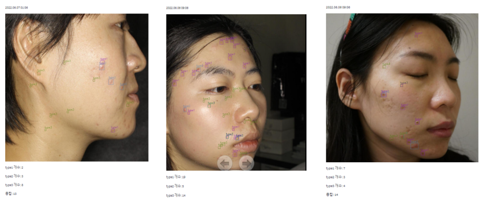

# 서비스 

* 사진으로 사용된 얼굴 이미지는 개인정보 문제로 ACNE04 Dataset에서 가져왔습니다.

  

## 가설 설정 및 프로젝트 목표
- 이 서비스를 사용하는 사용자들은 평소에도 피부 건강에 관심이 많고 꾸준히 관리를 하는 꼼꼼한 성격일 가능성이 높다고 가정하였음
- 많은 사람들이 자신이 가지고 있는 트러블 개수를 일일이 세어가면서 기록하지 않는다고 가정, 서비스가 이러한 부분을 도와줄 수 있는 방향으로 진행
- 처음 사용자에게는 트러블 디텍션을 진행 후 트러블을 시각화 및 종류, 개수를 정리해서 보여준다
- 이후 서비스를 재사용 시, 이전과 비교하여 피부의 변동 사항의 체크하여 사용자에게 피부의 변화를 알려준다.
- 트러블의 변화도를 파악하여 사용자에게 피부 관리 방향성을 유도하면 더욱 좋은 서비스가 될 것이라 생각한다(추가 구현 사항)

  

**구현 내용**

- 사용자 구분(회원가입 및 로그인)
- 개인 사용자의 피부 트러블 디텍션
- 사용자의 지난 디텍션 히스토리 확인

  

**모델링(ERD)**

  

**사용 스택** 

  

**회원가입 및 로그인**
- 사용자의 개인 피부 관리를 위한 회원가입 및 로그인 
- 개인의 피부 디텍션 정보를 관리 가능

  

**피부 디텍션 수행**
- 사용자가 업로드한 피부(얼굴) 사진의 트러블 디텍션
- 트러블은 총 3가지 type으로 구분되며 각각의 개수를 count하여 사용자에게 반환

  

**트러블 디텍션 히스토리 제공**
- 사용자의 피부 트러블 조회 내역을 최신순으로 제공
- 사용자는 히스토리를 보며 자신의 피부 트러블 변화를 체감 가능

## 보완점(개선점)

- 프론트엔드까지 구현해볼 시간이 부족하여 빠르게 streamlit으로 구현하다보니 사용자 화면이 미흡하다.
- 히스토리를 불러올 때, 더 효율적으로(캐싱 등) 가져올 수 있는 방법이 있을 것 같은데 sqlAlchemy의 숙련도 부족으로 수행하지 못하고 있다(계속 찾아보는 중..)
- 해상도가 매우 높은 모델에 대해서 처리가 잘 되지 않는 현상 때문에 현재는 모든 인풋 이미지에 대해서 1024 x 1024로 resize를 진행 후 모델에 넣는 방식인데, 더 나은 방식을 찾아보아야 할 것 같다.

